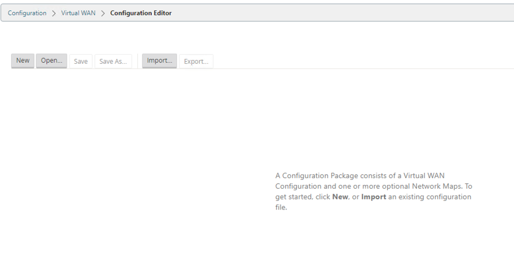
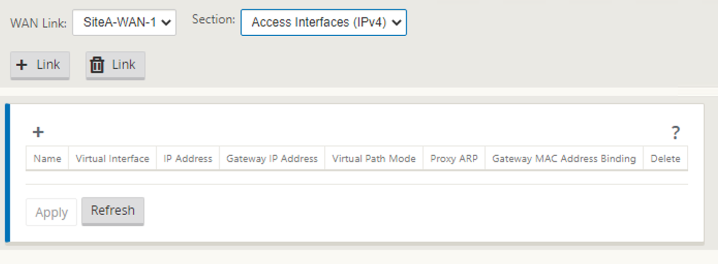
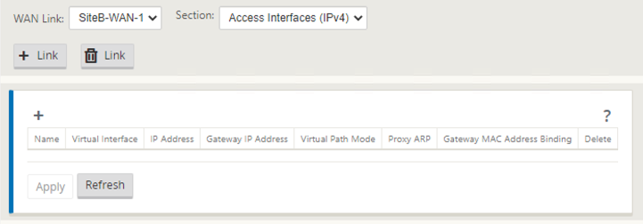
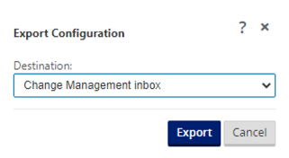

# LAB01: 管控一体解决方案

## 更新时间

2021.05.20

## 1. 实验拓扑


## 2. 准备工作

Citrix SD-WAN软件版本信息：https://www.citrix.com/support/product-lifecycle/product-matrix.html

Citrix SD-WAN安装介质下载：https://www.citrix.com/downloads/citrix-sd-wan/

Citrix SD-WAN数据手册：https://www.citrix.com/content/dam/citrix/en_us/documents/data-sheet/citrix-sd-wan-data-sheet.pdf

Citrix SD-WAN VPX安装手册：https://docs.citrix.com/en-us/citrix-sd-wan-platforms/vpx-models/vpx-se/prerequisites.html

## 3. 系统信息

| 组件               | 版本                                                         |
| ------------------ | ------------------------------------------------------------ |
| Hypervisor         | Citrix Hypervisor 8.2                                        |
| Switch             | Hypervisor vSwitch                                           |
| Router             | vyOS 1.4                                                     |
| SD-WAN             | SD-WAN VPX 14.0 (14.x版本是管控一体解决方案的长期稳定支持版本) |
| SD-WAN集中管理平台 | SD-WAN Center 14.0                                           |
| PC                 | Windows XP                                                   |

## 4. 方案特点

Citrix SD-WAN管控一体解决方案是面向企业级用户的最佳解决方案。相对于其他厂商，Citrix方案有如下优势：

1. 无需独立、额外的控制器设备，SD-WAN设备不仅用于数据转发，还可以用于控制器角色。不仅支持本地HA，控制器还可以支持异地HA。
2. 控制器设备位于企业网络内部，无需在互联网上暴露管理端口、无需指定硬件或云端控制。
3. 所有设备均支持带内、带外管理。
4. 仅MCN站点需要固定IP和端口（默认4980/UDP），其他站点无需广域网额外配置。

## 5. SD-WAN VPX安装

首先，到Citrix官方网站下载OVA部署模版，根据安装手册步骤完成虚拟机部署，然后完成如下调整：

1. 按需调整CPU、Memory资源
2. 编辑虚拟机配置，修改磁盘空间为240GB
3. 增加所需的Network Adapter数量，注意：所有Adapter的Adapter Type必须一致
4. 调整虚拟机兼容性属性为：ESXi 6.5 and later
5. 启动虚拟机

## 6. SD-WAN VPX配置

使用默认管理员用户名密码登录：admin / password，然后修改管理员密码


配置带外管理地址、掩码和网关

```
management_ip

set interface 192.168.210.12 255.255.255.0 192.168.210.254

apply

y
```


打开浏览器，访问带外管理地址


访问菜单：Configuration - Appliance Settings - Licensing，通过HostID申请许可。然后点击"Choose File"，选择License文件，点击"Upload and Install"完成许可配置


注意："Maintenance Expiration Date"，如果SD-WAN软件发布时间晚于这个日期，那么SD-WAN设备无法升级到该版本

访问菜单：Configuration - System Maintenance - Date/Time Settings，配置NTP和调整时区


## 7. SD-WAN组网配置(SiteA站点)

访问菜单：Configuration - Virtual WAN - Configuration Editor，开始SD-WAN组网配置



点击"New"创建一个新的配置文件


点击"+ Sites"，创建站点SiteA

1. Site Name: SiteA
2. Memory (GB): 按VPX配置填写
3. CPUs: 按VPX配置填写
4. Mode: Primary MCN


点击"Sites"，"Site"下拉框选择"SiteA"


点击"Interface Group"，点击"+"，根据实验拓扑图完成接口策略配置


点击"Virtual IP Addresses"，点击"+"，根据实验拓扑图完成接口IP地址配置


点击"WAN Links"，点击"+ Link"，根据实验拓扑图完成广域网链路配置

SiteA: MSTP专线

1. Name: SiteA-WAN-1
2. Access Type: Private Intranet
3. Physical Rate: 20000 kbps
4. Public IPv4 Address: None
5. Congestion Threshold: 1000000


选择"Section"下拉框为"Access Interfaces(IPv4)"



点击"+"，输入接口和地址信息

1. Name: 默认
2. Virtual Interface: WAN-1
3. IP Address: 192.168.212.12
4. Gateway IP Address: 192.168.212.111


SiteA: Internet线路

1. Name: SiteA-WAN-2
2. Access Type: Public Internet
3. Physical Rate: 50000 kbps
4. Public IPv4 Address: 77.77.77.11
5. Congestion Threshold: 1000000


选择"Section"下拉框为"Access Interfaces(IPv4)"


点击"+"，输入接口和地址信息

1. Name: 默认
2. Virtual Interface: WAN-2
3. IP Address: 192.168.213.12
4. Gateway IP Address: 192.168.213.111


## 8. SD-WAN组网配置(SiteB站点)

点击"+ Sites"，创建站点SiteB

1. Site Name: SiteB
2. Memory (GB): 按VPX配置填写
3. CPUs: 按VPX配置填写
4. Mode: Client


点击"Sites"，"Site"下拉框选择"SiteB"


点击"Interface Group"，点击"+"，根据实验拓扑图完成接口策略配置


点击"Virtual IP Addresses"，点击"+"，根据实验拓扑图完成接口IP地址配置


点击"WAN Links"，点击"+ Link"，根据实验拓扑图完成广域网链路配置

SiteB: MSTP专线

1. Name: SiteB-WAN-1
2. Access Type: Private Intranet
3. Physical Rate: 10000 kbps
4. Autodetect Public IP: None
5. Congestion Threshold: 1000000


选择"Section"下拉框为"Access Interfaces(IPv4)"



点击"+"，输入接口和地址信息

1. Name: 默认
2. Virtual Interface: WAN-1
3. IP Address: 192.168.222.12
4. Gateway IP Address: 192.168.222.111


SiteB: Internet线路

1. Name: SiteB-WAN-2
2. Access Type: Public Internet
3. Physical Rate: 20000 kbps
4. Autodetect Public IP: Enabled
5. Congestion Threshold: 1000000


选择"Section"下拉框为"Access Interfaces(IPv4)"


点击"+"，输入接口和地址信息

1. Name: 默认
2. Virtual Interface: WAN-2
3. IP Address: 192.168.223.12
4. Gateway IP Address: 192.168.223.111


## 9. SD-WAN组网配置(SiteA-SiteB间虚拟通道)

点击"Connections"，"Site"下拉框选择"SiteA"，点击"Virtual Paths"


点击"Virtual Path to Site"，选择"SiteA-SiteB"。点击"Section"下拉框，选择"WAN Links"，勾选所有WAN Link，使用默认4980/UDP端口


点击"Connections"，"Site"下拉框选择"SiteB"，点击"Virtual Paths"


点击"Virtual Path to Site"，选择"SiteA-SiteB"。点击"Section"下拉框，选择"WAN Links"，勾选所有WAN Link，使用默认4980/UDP端口


点击左下方"Audit Now"，进行配置校验，确认"Audits: 0"，没有报错


## 10. SD-WAN组网配置(SiteC站点)

点击"+ Sites"，创建站点SiteC

1. Site Name: SiteC
2. Memory (GB): 按VPX配置填写
3. CPUs: 按VPX配置填写
4. Mode: Client


点击"Sites"，"Site"下拉框选择"SiteC"


点击"Interface Group"，点击"+"，根据实验拓扑图完成接口策略配置


点击"Virtual IP Addresses"，点击"+"，根据实验拓扑图完成接口IP地址配置


点击"WAN Links"，点击"+ Link"，根据实验拓扑图完成广域网链路配置

SiteC: Internet线路

1. Name: SiteB-WAN-1
2. Access Type: Public Intranet
3. Physical Rate: 10000 kbps
4. Autodetect Public IP: Enabled
5. Congestion Threshold: 1000000


选择"Section"下拉框为"Access Interfaces(IPv4)"


点击"+"，输入接口和地址信息

1. Name: 默认
2. Virtual Interface: WAN-1
3. IP Address: 77.77.77.13
4. Gateway IP Address: 77.77.77.254


## 11. SD-WAN组网配置(SiteA-SiteC间虚拟通道)

点击"Connections"，"Site"下拉框选择"SiteC"，点击"Virtual Paths"


点击"Virtual Path to Site"，选择"SiteA-SiteC"。点击"Section"下拉框，选择"WAN Links"，勾选所有WAN Link，使用默认4980/UDP端口


点击左下方"Audit Now"，进行配置校验，确认"Audits: 0"，没有报错


## 12. 下发配置并激活SD-WAN网络

点击左上方"Save"或"Save As"保存配置到配置管理器


点击"Export"，推送配置到变更管理器




点击"Configuration - Virtual WAN - Change Management - Begin"，准备开始下发配置


首先访问Citrix软件下载网站，下载软件更新包(ctx-sdw-sw-11.4.0.123.zip)，约 1.5GB


返回到变更管理界面，点击"Choose Files"，选中刚才下载的软件更新包(ctx-sdw-sw-11.4.0.123.zip)


点击"Upload"，上传该文件。上传完成后，在"Configuration"下拉框中选中刚才我们下发的配置，然后点击"Stage Appliances"


同意最终用户协议，然后点击"OK"


配置下发完成，然后点击"Next"


点击"Activate Staged"，开始激活配置和对应软件版本


点击"Done"，完成配置下发和激活


第一次下发配置，由于隧道没有建立所以SiteB和SiteC无法获取配置，需要手工进行更新。隧道建立后，配置会自动推送到所有站点。

点击"Configuration - Virtual WAN - Change Management"


点击"SiteB-SiteB-VPX"和"SiteC-SiteC-VPX"对应的"active"链接，下载配置配置


访问SiteB和SiteC的管理页面，点击"Configuration - System Maintenance - Local Change Management"


点击"Choose File"，选择刚才下载对应站点的配置文件，然后点击"Upload"


点击"Next"开始更新软件和激活配置


点击"Active Staged"开始更新软件和激活配置


点击"Done"完成软件更新和配置激活


## 13.0 检查SD-WAN网络状态

访问SiteA(MCN角色)的管理界面，点击"Monitoring - Statistics"，选择"Show"下拉框为"Paths(Summary)"，查看隧道状态


选择"Show"下拉框为"Routes"，查看路由表


