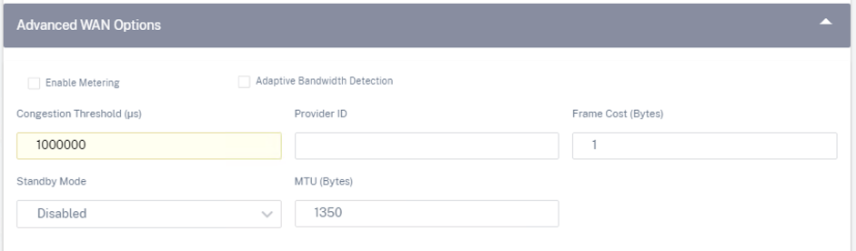

# LAB02: 管控分离解决方案

## 作者

Yazhong Shen(yazhong.shen@citrix.com)

## 更新时间

2021.05.26

## 1. 实验拓扑


## 2. 准备工作

Citrix SD-WAN软件版本信息：https://www.citrix.com/support/product-lifecycle/product-matrix.html

Citrix SD-WAN安装介质下载：https://www.citrix.com/downloads/citrix-sd-wan/

Citrix SD-WAN数据手册：https://www.citrix.com/content/dam/citrix/en_us/documents/data-sheet/citrix-sd-wan-data-sheet.pdf

Citrix SD-WAN VPX安装手册：https://docs.citrix.com/en-us/citrix-sd-wan-platforms/vpx-models/vpx-se/prerequisites.html

Citrix Orchestrator for On-Premise配置手册：https://docs.citrix.com/en-us/citrix-sd-wan-orchestrator-on-premises.html

## 3. 系统信息

| 组件               | 版本                                                  |
| ------------------ | ----------------------------------------------------- |
| Hypervisor         | ESXi 6.7                                              |
| Switch             | Hypervisor vSwitch                                    |
| Router             | vyOS 1.4                                              |
| SD-WAN             | SD-WAN VPX 11.3.1a (管控分离方案建议11.3.x或更高版本) |
| SD-WAN集中管理平台 | SD-WAN Orchestrator for On-Premise 10.3               |
| PC                 | Windows XP                                            |

## 4. 方案特点

Citrix SD-WAN管控分离方案是基于行业用户需求，实现多租户管理，方便用户实现站点快速上线、统一管理。相对于Citrix管控一体解决方案，有如下优点：

1. 多租户
2. 许可集中管理和分配
3. 零接触部署
4. NAT模式部署
5. 适合零售行业用户需求

## 5. SD-WAN VPX安装

请参考管控一体解决方案实验：https://github.com/yazshen/citrix-sdwan-configuration/blob/master/citrix-sdwan-101-lab01.md

注：SD-WAN Appliance上无需配置License

## 6. Orchestrator for On-Premise安装

从Citrix网站下载对应版本的部署模版，在Hypervisor平台上完成部署。编辑虚拟机配置：

1. 按需修改CPU, Memory, Hard Disk配置，参考：https://docs.citrix.com/en-us/citrix-sd-wan-orchestrator-on-premises/system-requirements-installation.html
2. 调整虚拟机兼容性属性为：ESXi 6.5 and later

## 7. Orchestrator for On-Premise管理网络配置

使用默认用户名密码 admin / password登录console，第一次登录必须修改密码。然后，配置管理网络

```
management_ip
set interface 192.168.50.194 255.255.255.0 192.168.50.254
y
```


## 8. Onboarding凭证

不同于Citrix管控一体解决方案，Orchestrator for On-Premise需要先注册Citrix Cloud账号，然后创建并保存客户凭证，包括：Customer Name, ID, Secret Key

参考链接：https://docs.citrix.com/en-us/citrix-sd-wan-orchestrator-on-premises/orchestrator-on-premises-log-in.html

## 9. Orchestrator for On-Premise初始化配置

浏览器打开Orchestrator for On-Premise的管理页面，第一次登录必须输入: Customer ID, Client ID, Client Secret信息


注：每隔15天会重复该页面用于认证客户凭证信息

使用默认用户名密码 admin / password登录系统


选择菜单"Infrastracture - Orchestrator Administration - Management Settings - NTP"，修改NTP服务器地址和时区


选择菜单"Infrastracture - Orchestrator Diagnostics - Reboot Orchestrator VM"，点击"Reboot"进行重启 (目前有BUG，不建议操作)


选择菜单"Infrastracture - Orchestrator Administration - Software Images - Appliance"，下载SD-WAN网络的软件介质


从Software Version列表框选择"11.3.1.53"，然后点击"Publish"


根据网络状况不同，等待一段时间后，点击"Refresh"查看下载进度


## 10. SD-WAN设备对接准备

SD-WAN设备可以通过OOB带外管理网络访问Orchestrator for On-Premise，并且支持NAT方式。对接支持三种认证方式：

1. No Authentication
2. One-way Authentication
3. Two-way Authentication

注：本实验采用了One-way Authentication方式

浏览器登录Orchestrator for On-Premise管理页面，访问菜单"Administration - Certificate Authentication"，关闭"Authentication Type"


第一次操作的时候，点击"Regenerate"，重新生成证书


点击"Download"下载Orchestrator for On-Premise证书并妥善保存到本地PC

浏览器登录到SD-WAN设备的管理页面，选择菜单"Configuration - Virtual WAN - On-Prem SD-WAN Orchestrator"


启用"Enable On-Prem SD-WAN Orchestrator Connectivity"，然后输入Orchestrator for On-Premise的IP地址或域名，这里我们使用了IP地址方式


在"Authentication Type"中选择"One-way Authentication"


在"On-Prem SD-WAN Orchestrator Certificate"中，上传刚才我们下载的Orchestrator证书


选择菜单"Dashboard"，保存SD-WAN设备的序列号信息


重复以上步骤，在另外2台SD-WAN设备上完成配置

## 11. SD-WAN组网配置

根据实验拓扑，通过Orchestrator for On-Premise开始SD-WAN组网配置

浏览器登录Orchestrator for On-Premise管理页面，访问菜单"Configuration - Network Config Home"


点击"Add Site"，添加一个新的站点


根据实验系统信息，变更如下配置，然后点击"Next"

1. Device Model: VPX
2. Sub-Model: BASE
3. Site Role: MCN
4. Bandwidth Tier(Mbps): 1,000
5. CPU: 4


输入站点设备的序列号信息，然后点击"Next"


点击"+Interface"，配置Interface 1接口信息，然后点击"Done"


再次点击"Done"


点击"+Interface"，配置Interface 2接口信息，然后点击2次"Done"


点击"+Interface"，配置Interface 3接口信息，然后点击2次"Done"


In-band Management IP选择"192.168.211.92"，然后点击"Next"


点击"+WAN Link"，配置WAN-1广域网链路信息


选择"Create New"，然后点击"Done"


修改如下配置，然后点击2次"Done"

1. Access Type: Private Internet
2. ISP Name: <按需选择>
3. Link Name: WAN-1
4. Egress (Mbps): 20
5. Ingress (Mbps): 20
6. Virtual Interface: WAN-1
7. IP Address: 192.168.212.92
8. Gateway IP Address: 192.168.212.191 
9. Congestion Threshold: 1000000


点击"+WAN Link"，配置WAN-2广域网链路信息

修改如下配置，然后点击2次"Done"

1. Access Type: Public Internet
2. ISP Name: <按需选择>
3. Link Name: WAN-2
4. Public IPv4 Address: 77.77.77.91
5. Egress (Mbps): 50
6. Ingress (Mbps): 50
7. Virtual Interface: WAN-2
8. IP Address: 192.168.213.92
9. Gateway IP Address: 192.168.213.191 
10. Congestion Threshold: 1000000




完成WAN Link配置后，点击"Next"


跳过"Routes"配置，然后点击"Next"


核对站点所有配置，确认无误后，点击"Done"


刷新页面，确认站点的Orchestrator Connectivity状态为绿色


重复以上步骤，完成其他2个站点的配置，注意"Site Role"配置选择"Branch"


点击站点名称，然后选择"Verify Config"，确认配置校验没有错误


重复点击另外2个站点，确认配置校验没有错误

## 12. 推送组网配置到SD-WAN设备

选择菜单"Configuration - Network Config Home"，选择Software Version为"11.3.1.53"


点击"Deploy Config/Software"


点击"Stage"开始推送配置和软件版本


点击"Activate"，激活配置，完成SD-WAN配置下发


## 13. SD-WAN网络监控

选择菜单"Dashboard"，查看当前SD-WAN整网虚拟通道状态、节点信息


点击站点名称，可以查看当前站点虚拟化通道的延迟、抖动、丢包和带宽使用率信息


访问菜单"Reports - Quality"，可以查看整网线路质量等信息


