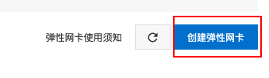
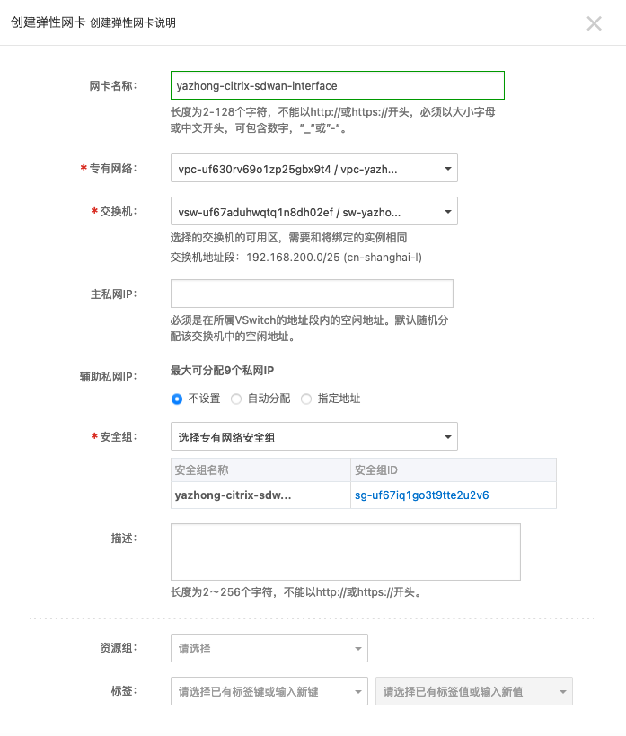

# 阿里云通过自定义镜像方式部署Citrix SD-WAN

## 作者

Yazhong Shen (yazhong.shen@citrix.com)

## 更新时间

2021.06.17

## 下载Citrix SD-WAN VPX for KVM镜像

首先，从Citrix官方网站下载VPX for KVM镜像

https://www.citrix.com/downloads/citrix-sd-wan/citrix-sd-wan-standard-premium-advance-edition/vpx-release-113153.html

下载完成后，校验SHA-256

解压缩gz文件，得到ctx-sdw-os-11.3.1.53_kvm.qcow2文件

## 创建新的对象存储

登录到阿里云管理界面后，访问”产品与服务 - 存储与CDN - 对象存储OSS“

点击"创建Bucket"

输入Bucket相关信息，注意以下细节：

地域：必须和预计部署SD-WAN ECS实例相同，否则无法找到该Bucket

存储类型：标准存储

读写权限：私有

Bucket创建成功后，选中该Bucket，然后点击“文件管理 - 上传文件"

保持默认选项，然后上传qcow2文件

完成qcow2文件上传

返回文件管理目录，然后点击“详情”

点击“复制文件URL“，保存链接供后续使用

## 创建新的ECS实例自定义镜像

访问”产品与服务 - 弹性计算 - 云服务器ECS“

访问“实例与镜像 - 镜像"

访问“导入镜像 - 导入镜像“

输入镜像相关信息，注意以下细节：

镜像所在区域：必须和刚才Bucket文件位置一致

OSS Object地址：输入我们刚才复制的文件URL

操作系统/平台：选择“Linux - Others Linux"

系统盘大小：可选40GiB、120GiB、240GiB，建议240GiB

（参考依据：https://docs.citrix.com/en-us/citrix-sd-wan-platforms/vpx-models/vpx-se/prerequisites.html)

系统架构：x86_64

刷新页面，等待几分钟后显示状态为“可用”

## 创建新的专有网络VPC

（如果已经有VPC，忽略本节。）

访问”产品与服务 - 网络 - 专有网络VPC“

点击”创建专有网络“

输入vpc网络信息，交换机配置信息。在这里我们规划了sd-wan实例采用旁路模式并且OOB和LAN网络相同。如果OOB和LAN网络要区分，可以在vpc下创建2个不同的交换机

注意：交换机要和规划的实例所在可用区一致

创建完成后，确认VPC网络状态为“可用”

## 创建新的弹性公网地址

Citrix SD-WAN默认需要2个公网地址，一个用于OOB管理，另外一个用于业务接口组网。阿里云默认会分配给ECS实例第一个网卡一个弹性公网IP，所以我们还需要额外创建一个弹性公网IP用于业务接口组网。

访问”产品与服务 - 网络 - 专有网络VPC - 弹性公网IP - 弹性公网IP“

点击“创建弹性公网IP”

选择合适的流量带宽、资费类型

注意：地域和可用区要保持一致。

完成后，确认弹性公网IP地址信息

## 创建Citrix SD-WAN实例

访问”产品与服务 - 弹性计算 - 云服务器ECS“

点击“网络与安全 - 安全组“

点击“创建安全组”

输入网络安全组信息：

网络：选择刚才创建的VPC网络

访问规则方向：入方向

访问规则：80/tcp, 443/tcp, 4980/udp, icmp

点击“网络与安全 - 弹性网卡“

点击“创建弹性网卡“，为接下来SD-WAN的ECS实例创建业务接口网卡

输入必要信息：

专有网络

交换机

安全组

检查弹性网卡状态为“可用”

返回到“弹性公网IP”管理页面，选择刚才新购的弹性公网IP，然后点击“绑定资源”

选择资源类型：

实例类型：辅助弹性网卡

实例：刚才创建的弹性网卡

完成后，确认资源绑定

返回云服务器ECS管理界面，点击“实例与镜像 - 实例“

点击“创建实例“

根据SD-WAN VPX资源需求，选择对应的资源规格

(https://www.citrix.com/content/dam/citrix/en_us/documents/data-sheet/citrix-sd-wan-data-sheet.pdf)

注意：可用区要和刚才创建的网络资源一致。

选择自定义镜像

选择主网卡（也就是OOB网络）属性、公网地址与流量、安全组

选择登录凭证为“使用镜像预设密码“

其他属性保持默认或根据实际需求更改，点击“创建实例”，然后检查实例状态

选中实例，然后点击“停止 - 停止后仍旧保留实例并继续收费“

等待实例停止后，编辑实例，点击“绑定辅助弹性网卡“，为SD-WAN实例创建业务接口

添加辅助弹性网卡

完成后，确认实例上的网卡信息

点击“实例详情 - 修改远程连接（VNC）密码“

注意密码格式要求

再次启动该实例，然后点击“远程连接”

点击“VNC远程连接 - 立即登录“

输入VNC密码

然后就可以通过Console方式进行Citrix SD-WAN初始化配置。

